# upython
 
 Curso sobre _MicroPython_ del día 26 de mayo 2019.

## Contenidos del curso

* [Qué es MicroPython](#qué-es-micropython)
* [Pasos Previos](#pasos-previos)
* [Primeros pasos con MicroPython](#primeros-pasos)
* [Entrada/Salida Digital](#entradasalida-digital)
* [Entrada/Salida Analógica](#entradasalida-analogica)
* [Sensores](#sensores)
* [ESP8266](#esp8266)
* [Proyecto Final](#proyecto-final)
* [Pinout de NodeMCU](#pinout-del-nodemcu)

## Qué es Micropython

_MicroPython_​ es una implementación software del lenguaje de programación Python 3, escrita en C, y que está optimizada para poder ejecutarse en un microcontrolador.3​4​ _MicroPython_ es un compilador completo del lenguaje Python y un motor e intérprete en tiempo de ejecución, que funciona en el hardware del microcontrolador. 

Al usuario se le presenta una línea de órdenes interactiva (el REPL) que soporta la ejecución inmediata de órdenes. Se incluye una selección de bibliotecas fundamentales de Python: _MicroPython_ incluye módulos que permiten al programador el acceso al hardware en bajo nivel.

_MicroPython_ permite ser ejecutado en distintas placas con diferentes microcontroladores. En nuestro caso, utilizaremos la placa NodeMCU con el microcontrolador ESP32. Puedes usar de manera muy parecida la placa más económica ESP8266, igualmente válida para apredizaje y proyectos de pequeña envergadura.

Para saber qué placas son compatibles, consulta la [documentación oficial](http://docs.micropython.org).

## Pasos Previos

Antes de poder instalar _MicroPython_, necesitaremos tener instalado Python 3.6 o superior.

### Instalación

#### Linux y MacOS

Utilizando la herramienta _pip_ instalamos todo lo necesario en un solo paso. Esto es posible porque el editor de aprendizaje _Thonny_ realiza en un solo paso todo lo necesario para empezar, resolviendo por nosotros los problemas iniciales. Frente a todas estas ventajas, como inconveniente el editor _Thonny_ sólo está en idioma inglés y no hay planes de traducirlo.

Cuando tengamos más soltura, podemos pasar a nuestro editor habitual sin problema, pero habremos ahorrado mucho tiempo en el proceso. 

Para instalar el editor _Thonny_, debemos comprobar que la versión de python que estamos ejecutando es la 3:

```bash
$ python --version
Python 2.7.15rc1

```
Si no lo es, actuaremos en consecuencia. Por ejemplo:
```bash
$ python3 --version
Python 3.6.7

```

Y procederemos a la instalación:

```bash
$ python3 -m pip install thonny-esp

```

Alternativamente, y si *python3* no es una orden reconocida, pero nuestra versión de python es la 3, podemos probar:

```bash
$ python -m pip install thonny-esp

```

Ahora tenemos dos posibilidades: o bien ejecutamos directamente el editor mediante la orden "thonny" o bien, si este procedimiento falla, mediante python.

```bash
$ thonny &

```

o alternativamente:

```bash
$ python -m thonny &

```

#### MacOs

En MacOs la operación es la misma. Sin embargo, en caso de no tener el chip de comunicación CP2102, debemos instalar los drivers del chip alternativo USB CH340/CH341. Los podemos descargar [aquí](http://www.mblock.cc/docs/run-makeblock-ch340-ch341-on-mac-os-sierra/).

Una vez instalado, ya podremos ver el puerto serie en nuestro sistema.

El resto de pasos se realizan de igual forma que para Linux.

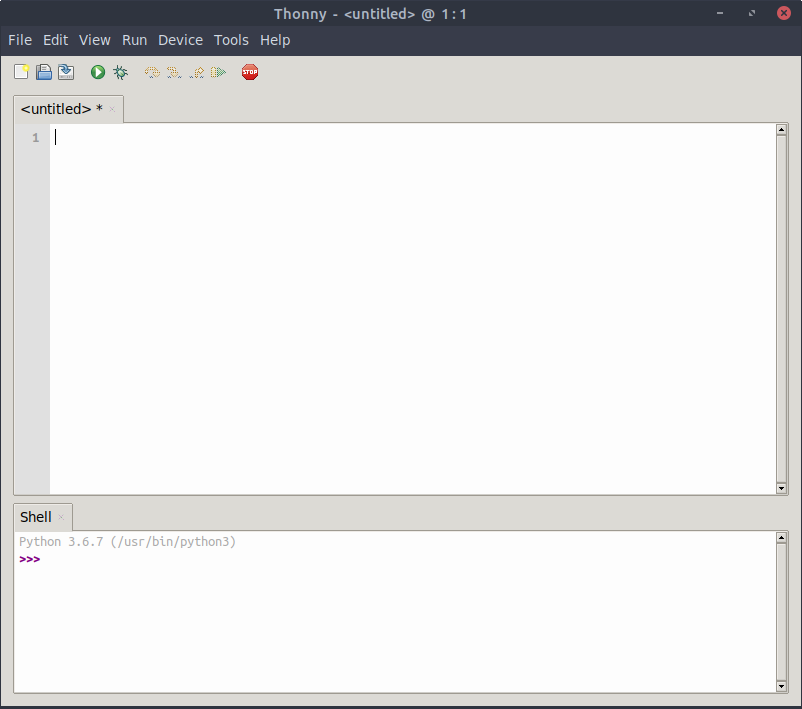

#### Windows

Para windows, en caso de no tener el chip de comunicación CP2102, también debemos instalar los drivers CH340/CH341; los podemos encontrar en la web del [fabricante](http://www.wch.cn/download/CH341SER_EXE.html).

Luego hay que ejecutar el Windows Power Shell y dentro de él las órdenes conocidas para las otras plataformas. Primero comprobamos que tenemos Python 3:

```bash
$ python --version
Python 3.6.7

```
De no ser así, tomaremos las medidas necesarias para conseguir tener instalado Python 3 y en condiciones de ejecutarse. Luego procederemos a instalar todo el sistema de aprendizaje en una sola orden:

```bash
$ python -m pip install thonny-esp

```
Una vez instalado el entorno de aprendizaje, seguiremos los mismos pasos que con Linux, especificando el puerto COM correspondiente dentro del editor _Thonny_, como veremos posteriormente.

### Obtención del firmware de MicroPython

Para poder instalar _MicroPython_, descargaremos el firmware de la [Página oficial](http://micropython.org/download#esp32) (Descargar el firmware para el chip correspondiente al ESP32). Una vez descargado, instalaremos las herramientas necesarias para _flashear_ el chip con el firmware de _MicroPython_. Lo instalaremos desde dentro del editor _Thonny_.

### Instalación del firmware

Tanto en Windows como en Linux/MacOs, seguiremos este procedimiento.

Antes de comenzar, conectamos la placa al PC por un puerto USB, abrimos un terminal y ejecutamos:

```bash
$ thonny &

```

o alternativamente:

```bash
$ python -m thonny &

```

Nos aparecerá una primera instancia del editor _Thonny_ con el intérprete de órdenes de Python que tengamos por defecto de nuestro sistema, en la parte inferior: 

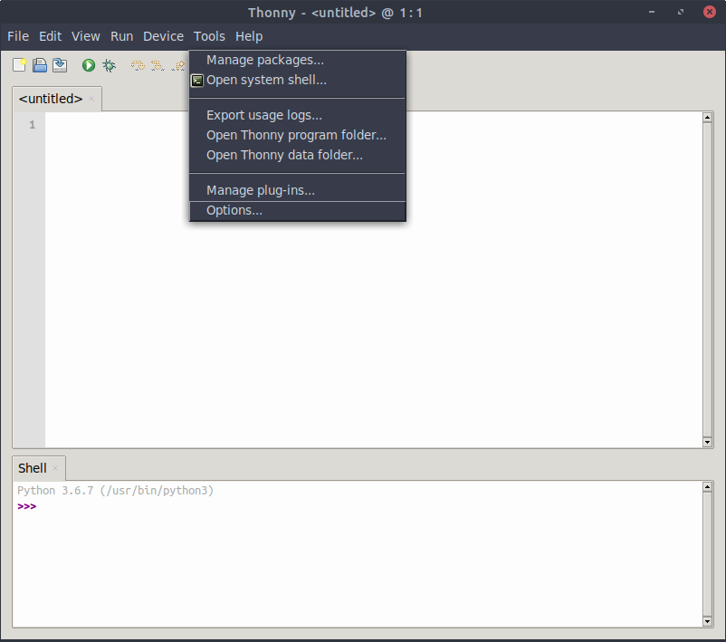

Podemos utilizar este editor para todas las operaciones básicas sin salirnos de él hasta que no cobremos más confianza, reduciendo de este modo los tiempos de instalación y la curva de aprendizaje inicial. Recuerde que es conveniente ejecutar Thonny con la placa ya conectada.

En primer lugar seleccionaremos la opción _Options_ del menú _Tools_, y una vez dentro de ella, podremos en primer plano la pestaña _Interpreter_.
Gracias a la orden única de instalación que hemos ejecutado, todos los programas y módulos necesarios para la comunicación se han instalado automáticamente. Tan sólo es necesario seleccionar aquí la placa ESP32, o en su defecto la ESP8266, ya que el procedimiento esra el mismo:

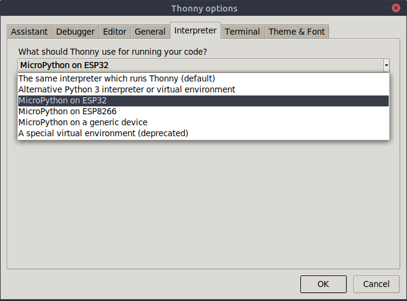


Una vez hecho esto, y sin salirnos de esta pestaña, tenemos un segundo menú desplegable más abajo, que nos permite seleccionar el puerto. Si observamos con detenimiento, veremos que una de las opciones es parecida a `CP2104 USB to UART Bridge Controller (/dev/ttyUSB0)`, es decir, que debido a que ya hemos conectado la placa antes de ejecutar _Thonny_, debería aparecernos una opción semejante:

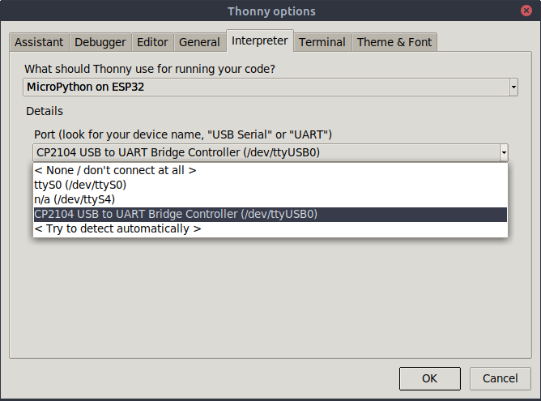

Ahora ya podemos pulsar OK y salirnos al programa principal. Observaremos que si nuestra placa no tiene ya el firmware de MicroPython, aparecerá un mensaje de error:

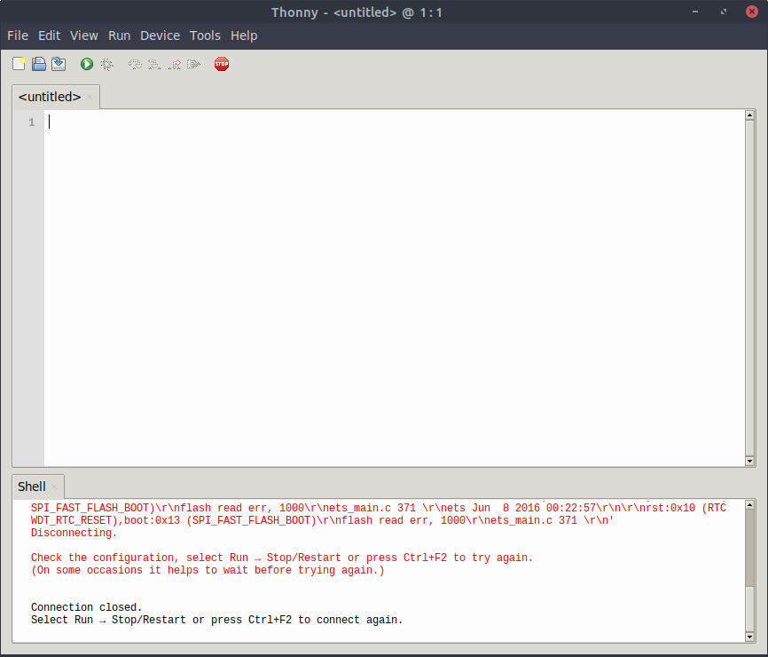

Debido a que ya tenemos seleccionado el puerto, podemos proceder a subir a la placa ESP32 el firmware de _MicroPython_. Para poder instalar _MicroPython_, descargaremos el firmware de la [Página oficial](http://micropython.org/download#esp32) (Descargar el firmware para el chip correspondiente al ESP32).
En el momento de realizar este tutorial, la última versión se podía obtener del [siguiente enlace](http://micropython.org/resources/firmware/esp32-ppp-fix.bin).

La guardamos en un lugar conocido (por ejemplo, el directorio estándar de descargas para el navegador) y, con la placa conectada y detectada, seleccionamos la opción de subir el firmware a la placa desde dentro de _Thonny_. Para ello debemos elegir el menú _Device_ y dentro de él la opción _Install MicroPython to ESP8266/ESP32_:

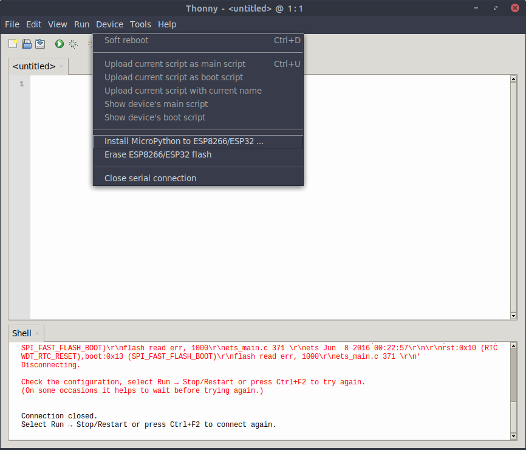

Y buscamos el lugar donde está disponible el firmware que nos hemos bajado. Elegimos el fichero, que tendrá la extensión `.bin`, y pulsamos aceptar:

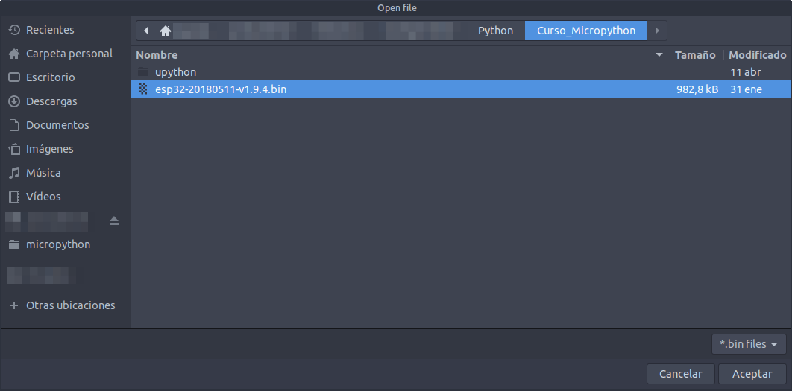

Automáticamente comenzará el proceso de flasheo de la placa, si ésta está conectada. En algunos casos puede ser necesario pulsar un botón en la placa:

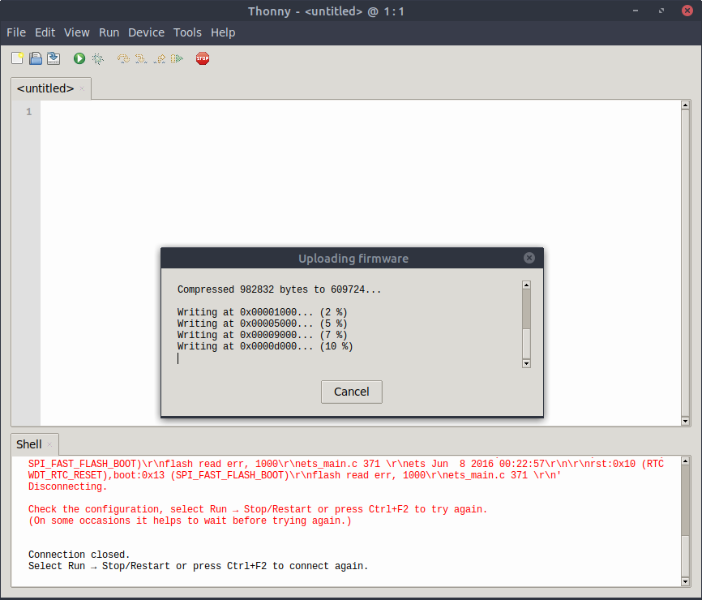


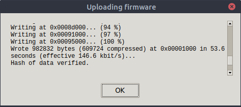


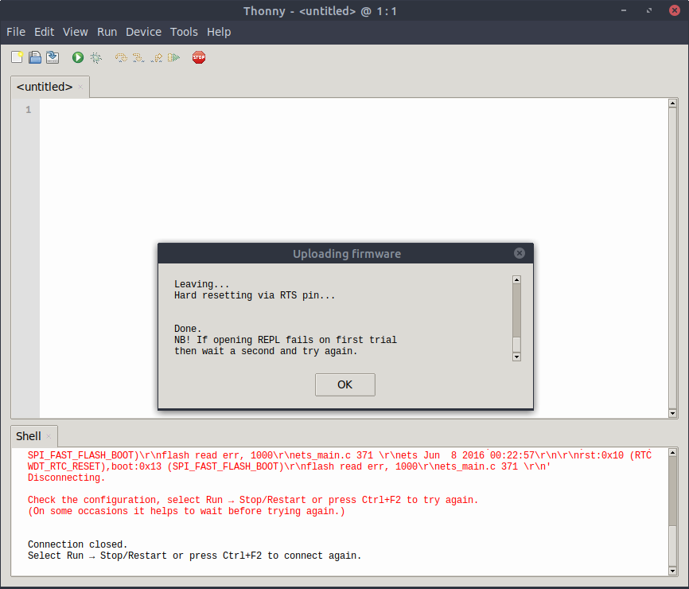

Pulsamos el botón "`OK`" y en el menú _Run_ seleccionamos _Stop/Restart Backend_:

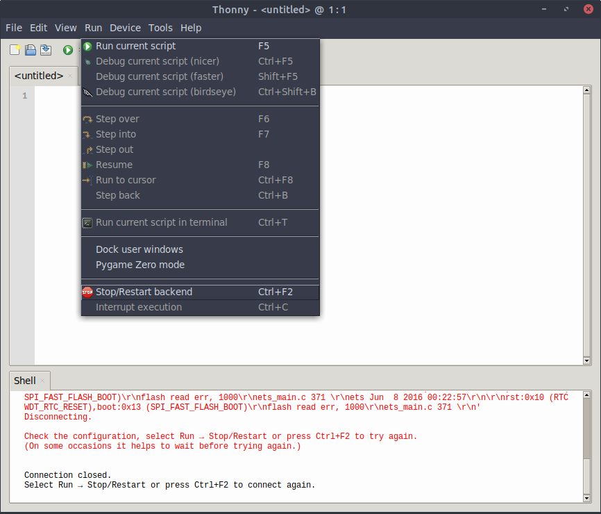

Y mágicamente tenemos una interfaz REPL Python (si falla, tendrás que reiniciar _Thonny_), pero lo más normal es que obtengamos directamente control sobre la placa a través del teclado en la ventana inferior:

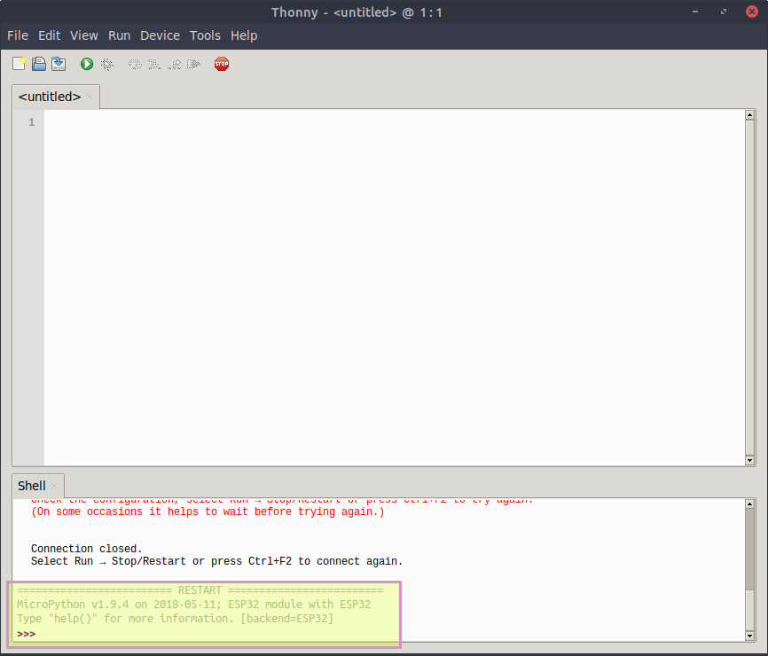

Ahora llevamos el cursor a donde está el signo `>>>` de intérprete de ordenes de _MicroPython_ en la ventana inferior de _Thonny_, y escribimos algunas órdenes:

```bash
>>> import sys
>>> sys.version
'3.4.0'

```
¡Enhorabuena! Hemos terminado nuestra instalación y primeros pasos de _MicroPython_. 

### Avanzado: herramientas de terminal

Puede ignorar este apartado, ya que haremos la conexión desde dentro de _Thonny_. Sin embargo, para usuarios avanzados, explicaremos brevemente las opciones de que disponen.

#### Linux

* picocom
* minicom

##### Usando *picocom*

```bash
picocom /dev/ttyUSB0 -b 115200
```
* <kbd>Control</kbd>-<kbd>a</kbd> <kbd>Control</kbd>-<kbd>x</kbd> SALIR
* <kbd>Control</kbd>-<kbd>a</kbd> <kbd>Control</kbd>-<kbd>c</kbd> LOCAL ECHO
* <kbd>Control</kbd>-<kbd>d</kbd> NODEMCU SOFT REBOOT


#### MacOS

Para conectarnos a la placa, usaremos _coolTerm_.

##### CoolTerm

Para descargar CoolTerm Puede hacerse desde el siguiente [enlace](http://freeware.the-meiers.org/CoolTermMac.zip)

Una vez descargado e instalado, se configurará el puerto a utilizar; pulsando en el botón _Options_.

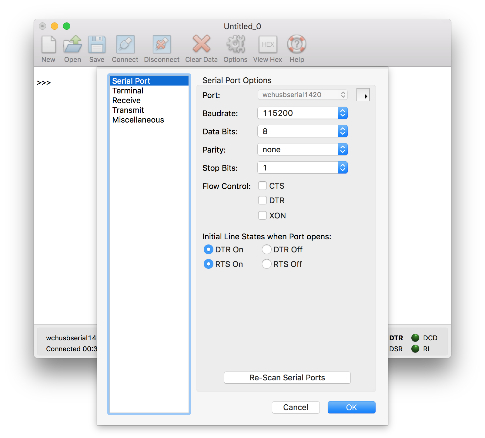

Una vez configurado el puerto (con el que nos aparece en nuestro MAC) y configurado el baudrate a _115200_. Pulsaremos OK y al botón _connect_. Apareciendo el promt de Python.

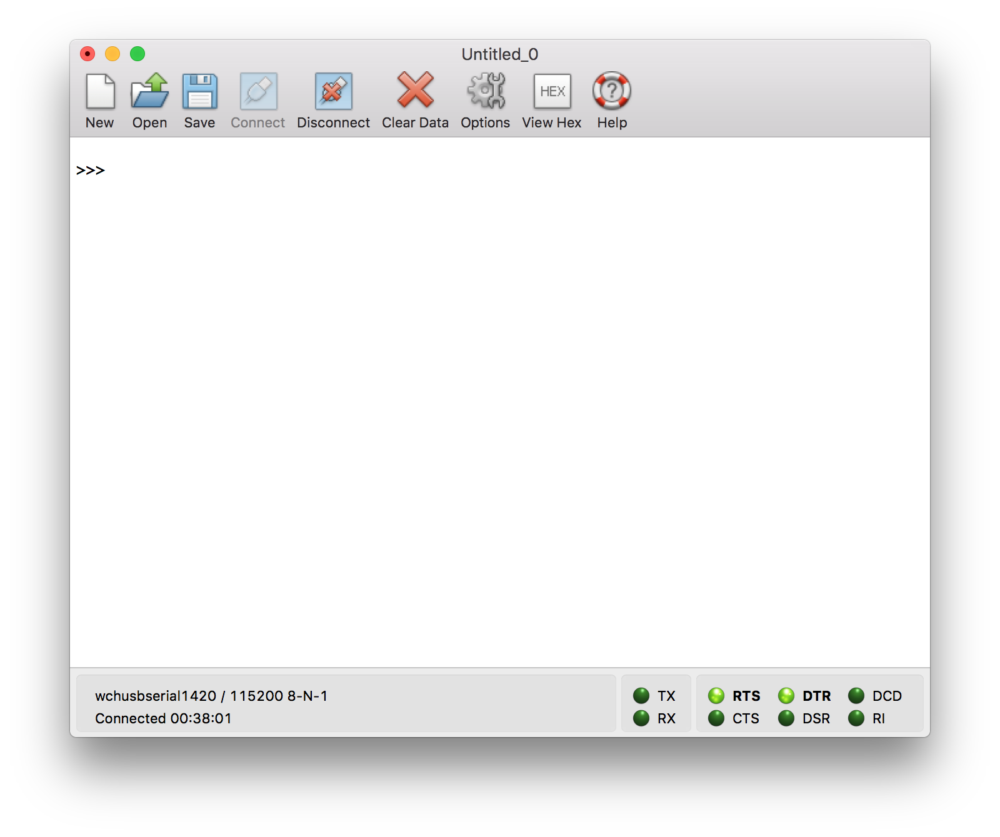

#### Windows

Para poder conectarnos via serial a nuestra placa NodeMCU, utilizaremos el famoso programa Putty; el cual podemos descargarnos [aquí](http://www.putty.org)

Una vez descargado el programa lo abriremos y seleccionaremos la conexion por serial.

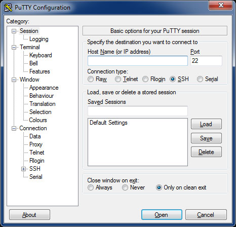

En la dirección escribiremos el puerto al que nos conectaremos (COMX) y en la velocidad pondremos 11520. 

Si requeririeramos una configuración mayor podemos ir al apartado serial y configurar nuestra placa.

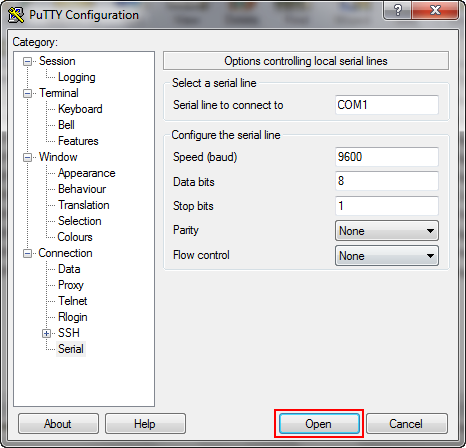

Una vez hecho esto, ya podemos continuar trabajando con nuestra placa.

### Otros IDES

Además de utilizar estas herramientas para conectarnos, podemos usar algunos IDES como _Thonny_ (el que usamos en esta documentación) o _Pycharm_:

**Pycharm Plugin de MicroPython**

Podemos usar un plugin para _pycharm_ para conectar con nuestra placa ESP y trabajar con _MicroPython_.

Puede verse más información en este [enlace](https://blog.jetbrains.com/pycharm/2018/01/micropython-plugin-for-pycharm/)


## Primeros Pasos

Una vez tengamos ya _MicroPython_, usaremos la consola serie integrada en el editor _Thonny_ para mandar las instrucciones Python; de forma que podremos ejecutar nuestro código python en el ESP32.

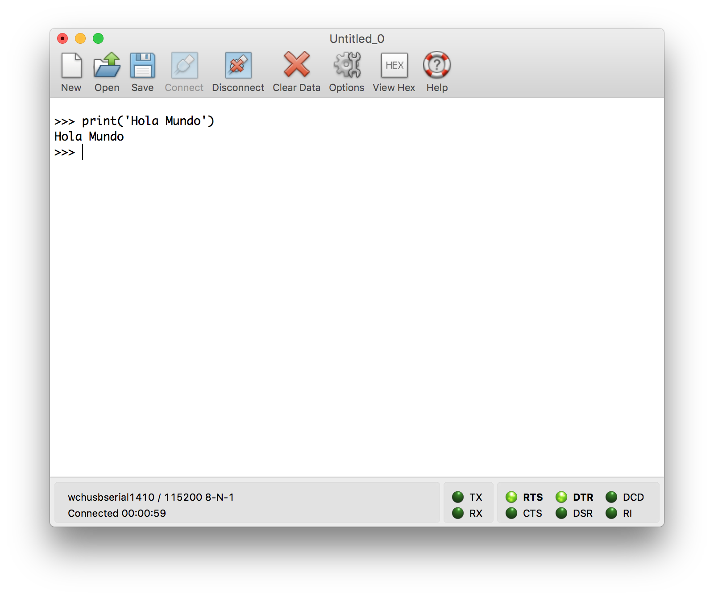

Podemos comprobar la version y el estado de nuestro firmware con el siguiente código.

```python

import esp
esp.check_fw()

```

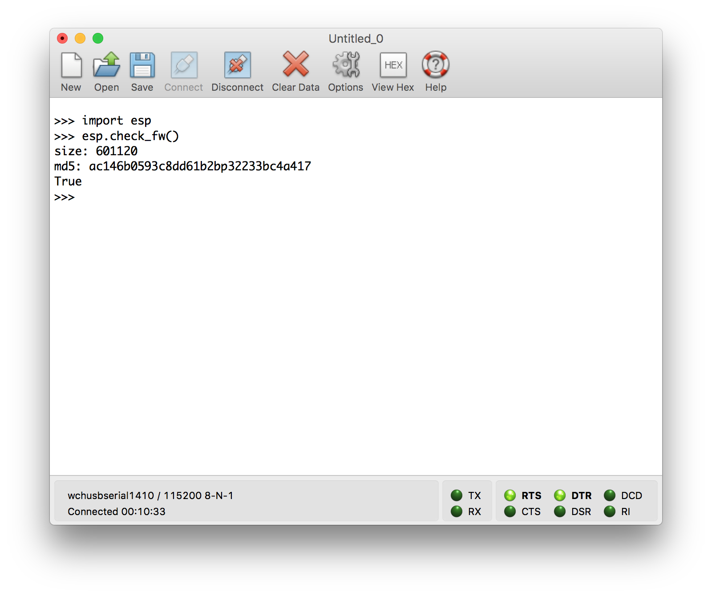

## Entrada/salida Digital

Lo principal a la hora de trabajar con electrónica, es poder utilizar las entradas/salidas digitales que nos proveen los distintos microcontroladores; es por esto que micropython permite trabajar con entradas/salidas digitales.

Una entrada/salida digital, permite mandar o recibir un pulso binario es decir, un 0 o un 1, apagado o encendido.

Otros aspecto importante es saber que es una entrada o una salida con respecto a electrónica.

* Una entrada es un puerto que permite recibir una señal.

* Una salida es un puerto que permite lanzar una señal.

En la placa NodeMCU que utilizamos en este curso, podemos ver que tiene una serie de salidas digitales que van desde el 0 al 8; que son las cuales tienen una D al lado.

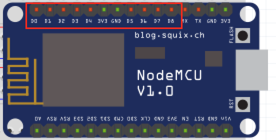

**NOTA**: A parte de estas entradas/salidas MicroPython permite utilizar otras entradas/salidas como digitales.

Para poder realizar esto, tenemos que saber la configuración de nuestra placa. En nuestro caso la NodeMCU; ya que micropython, no utiliza la misma nomenclatura que nuestra placa.

Micropython utiliza los GPIO de la placa para poder saber a qué puerto utilizar.

Para saber que puerto utilizar consultar el [Pinout de la NodeMCU](#pinout-del-nodemcu)

Por ejemplo, para usar el puerto D0, tenemos que usar el GPIO16.

Para poder usar los distintos puertos, tenemos que instanciar un objeto de la clase _Pin_.

```python
import machine 

pin = machine.Pin(16)
```

Otro aspecto a tener en cuenta es definir si el puerto será de entrada o de salida.

* Si es de salida, utilizaremos la constante _OUT_.
* Si es de entrada, utilizaremos la constante _IN_, seguido de la constante _PULL_UP_; la cual activa una resistencia interna para evitar cortocirtuitos.

**NOTA**: Una resistencia PULL_UP, permite evitar falsos positivos ya que permite dar un valor erroneo a la hora de utilizar las entradas o salidas.

```python
from machine import Pin

pout= Pin(16,Pin.OUT)
pin= Pin(4,Pin.IN,Pin.PULL_UP)
```
Sabiendo esto, ya podemos crear nuestro primer montaje, comunmente conocido como Blink u Hola Mundo.

### Primer Ejercicio: El Blink

Este primer montaje hará que un led parpadee.

Para este montaje necesitaremos:

* 1 NodeMCU
* 1 Led
* 1 resistencia 220 Ohmios
* cable de conexion.
* cable MicroUsb.

**Ejemplo del Blink**


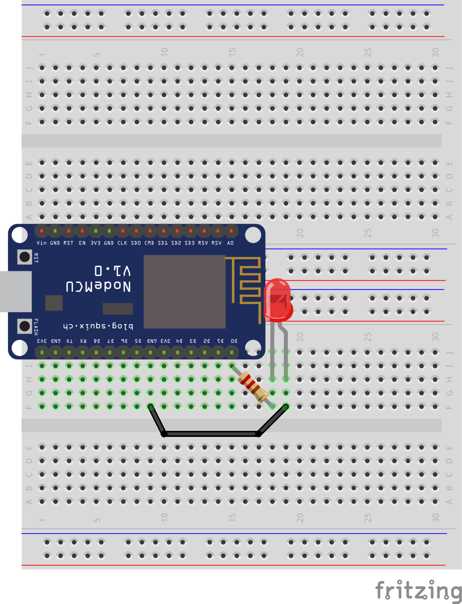

Código:

```python
from machine import Pin
import time
led=Pin(16,Pin.OUT)

while True:
    led.on()
    time.sleep(0.5)
    led.off()
    time.sleep(0.5)
```
En el ejemplo anterior, vemos que creamos un objeto de la clase Pin que asignamos al GPIO16, correspondiente al puerto D0 en modo salida.

Usando la función ```on()``` u ```off()``` podemos apagar o encender el led.

Este es un ejemplo de salida digital; seguidamente mostraremos un ejemplo de entrada digital. En este caso, el uso de pulsadores.

**NOTA:** La función ```sleep()``` del módulo ```time``` hace que se espere el tiempo pasado por parámetro en segundos.

###  Segundo Ejercicio: Pulsadores

Un pulsador es un ejemplo de entrada digital; ya que permite mandar un pulso (1) o ausencia de él (0); a partir de pulsarlo o no.

Para este montaje necesitaremos:

* 1 NodeMCU
* 1 pulsador
* 2 Resistencias 220 Ohmios
* 1 led
* cables de conexión
* cable microUsb.

**Ejemplo de Pulsadores**


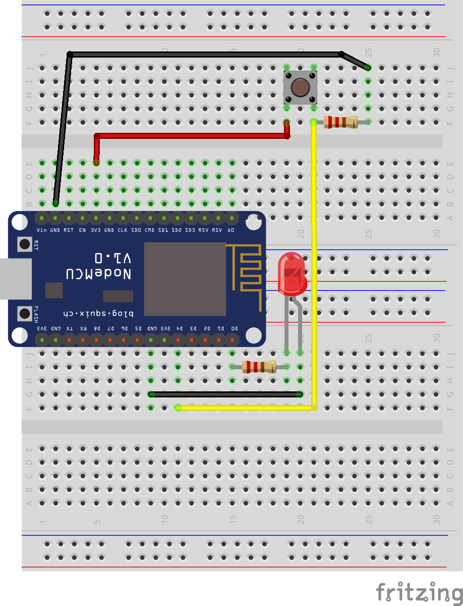

Código:

```python
from machine import Pin
import time

button=Pin(2,Pin.IN)
led=Pin(16,Pin.OUT)

while True:
    state=button.value()
    led.value(state)
    time.sleep(0.5)


```
En este ejemplo, definimos 2 Pines de forma que uno es de entrada y otro de salida. En función del valor del primer led, encendemos o no el segundo.


## Entrada/Salida Analogica

Una vez vistos las entrada y salidas digitales, pasaremos a ver las analógicas; de forma que podamos mandar un valor distintos de 0 o 1.

En el caso del ESP8266, como otros tantos MicroControladores, nos permite mandar o recibir valores analógicos.

### Tercer Ejecicio: Entradas Analógicas

La NodeMCU, permite recibir datos analógicos a través de un ADC (Analog DIgital Converter); de manera que toma el valor analógico y lo trasnforma a digital de forma que obtiene una serie de niveles de voltaje en función del valor obtenido.

Por eso utilizaremos la clase _ADC_; que nos permite leer de una de las entradas analógicas.

```python
from machine import ADC

adc= ADC(0)

adc.read()
```

Con este código, podemos leer de una entrada analógica; en este caso la 0(la NodeMCU solo tiene una entrada analógica).

En el caso de la NodeMCU tiene un ADC de manera que tiene una precisión de 10 bits. Esto quiere decir, que podemos detectar cambios de valores de entre 0 y 1023.

Para realizar este montaje:

* 1 NodeMCU
* 1 Potenciometro
* Cables de Conexión
* Cable MicroUSB.

**Ejemplo de lectura Analógica**

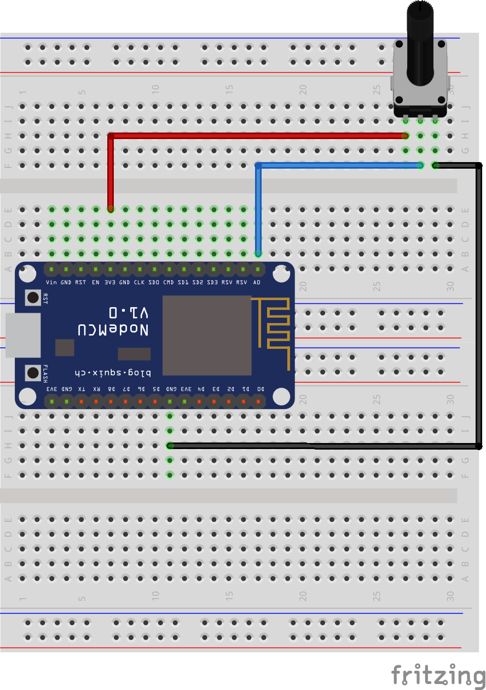

Código

```python

from machine import ADC

adc = ADC(0)

while True:
    print(adc.read())

```

**NOTA:** Para parar la ejecución, pulsaremos <kbd>control</kbd>+<kbd>c</kbd>.

### Cuarto Ejercicio: PWM

A la hora de utilizar las salidas analógicas, tenemos que saber que en la NodeMCU utiliza el llamado PWM.

El _PWM_(Pulse Width Modulation) es una ténica en la que se modifica el ciclo de trabajo de una señal periodica para transimitir información a través de un canal de comunicaciones o enviar una cantidad de energia.

Esto nos permite simular una salida analogica a través de un sistema digital. Modificando el ciclo de trabajo en un determinado tiempo para poder medir la cantidad de energía enviada.


En la NodeMCU tenemos 10 bits de precision por lo que podremos sacar un valor de 0 a 1023. Esto nos permitira por ejemplo, cambiar la intensidad del brillo de un led; cambiando el nivel de voltaje de este.

Seguidamente veremos un ejemplo de como cambiar la intensidad de un led.

Para este ejercicio necesitaremos:

* 1 NodeMCU
* 1 led
* 1 resistencia de 220Ohmios

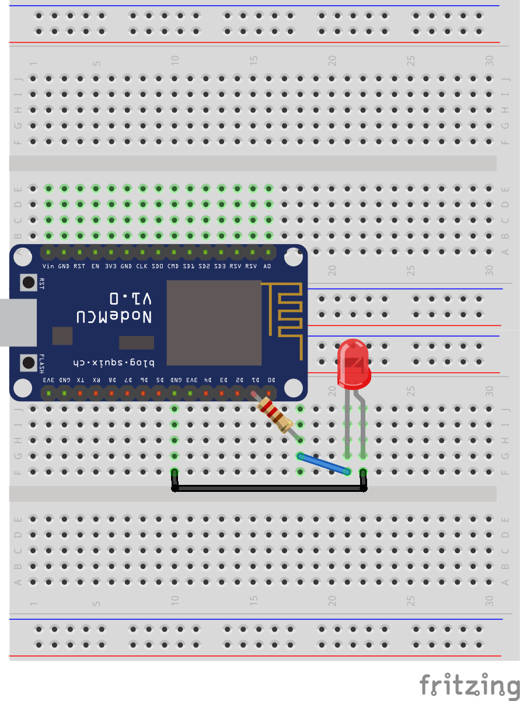

```python
import machine

pwm=machine.PWM(machine.Pin(5))
pwm.freq(60)

while True:
    for i in range(1024):
        pwm.duty(i)

```

**NOTA**: No se puede utilizar como PWM la salida digital 0 (GPIO16).

### Quinto Ejercicio: Entrada y salida Analógica

Una vez hemos visto como se utiliza por un lado la entrada analógica y por otro la salida analógica vamos a combinarlos para cambiar la intensidad de un led con una resistencia LDR o fotoresistencia.

Una fotoresistencia o LDR, es una resistencia que cambia de valor con respecto a la luz que reciba.


Para este ejercicio necesitaremos:

* 1 NodeMCU
* 2 Resistencias de 220Ohmios
* 1 Fotoresistencia
* cables de conexión

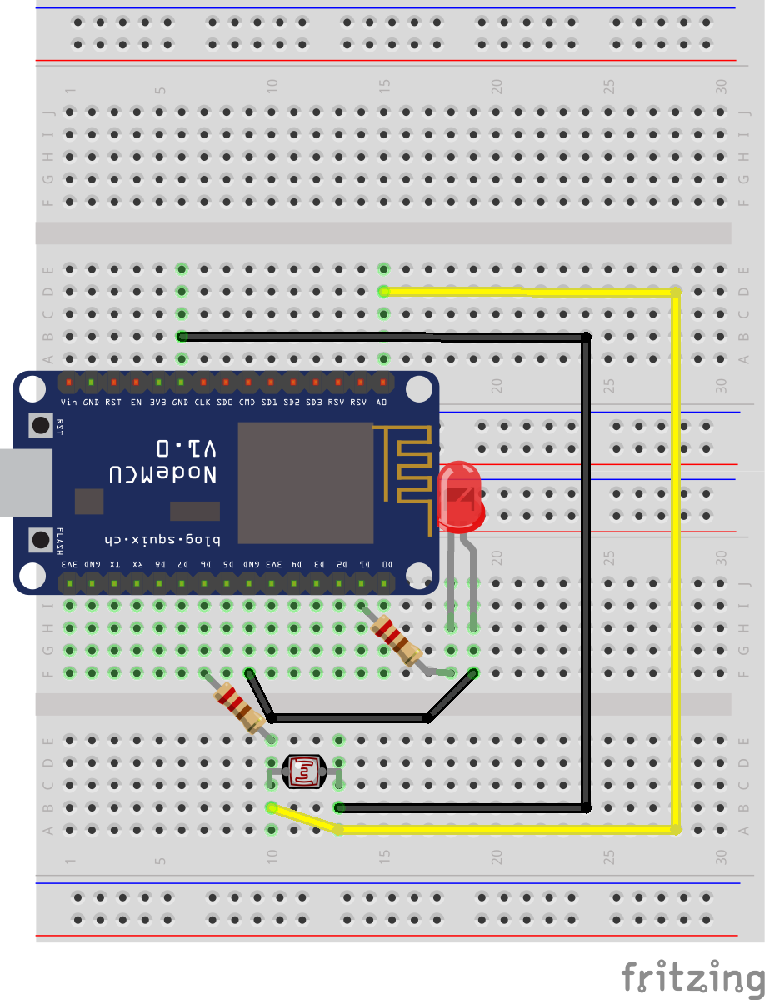


```python

from machine import Pin,PWM,ADC
 led=Pin(2)
 led.on()
 adc=ADC(0)
 pwm=PWM(led)
 pwm.freq(60)
 while True:
     pwm.duty(adc.read())

```

## Sexto Ejercicio:  Sensores

MicroPython permite trabajar con distintos tipos de sensores los cuales podemos utilizar tanto por librerias propias, como utilizando distintos protocolos como el I2C o en SPI. 

En nuestro caso, vamos a usar un sensor HC-SR04 de ultrasonidos el cual permite medir distancias utilizando pulsos de ultrasonidos. 

Para poder utilizar este sensor usaremos la librería modificada para el ESP8266 [ultrasonic](ultrasonic.py)

Por lo que en primer lugar nos descargaremos la librería. 

Una vez decargada, necesitaremos subirlo al microcontrolador por lo que utilizaremos el programa mpfshell para poder subir a la placa.

### Subida de ficheros con [mpfshell](#referencias)

Para subir ficheros con mpfshell en primer lugar lo instalaremos usando pip.

```bash
$pip install mpfshell
```

Una vez instalado, usaremos este programa para subir el fichero de la librería.

```bash
mpfshell tty.USB0 -c "put ultrasonic.py"
```


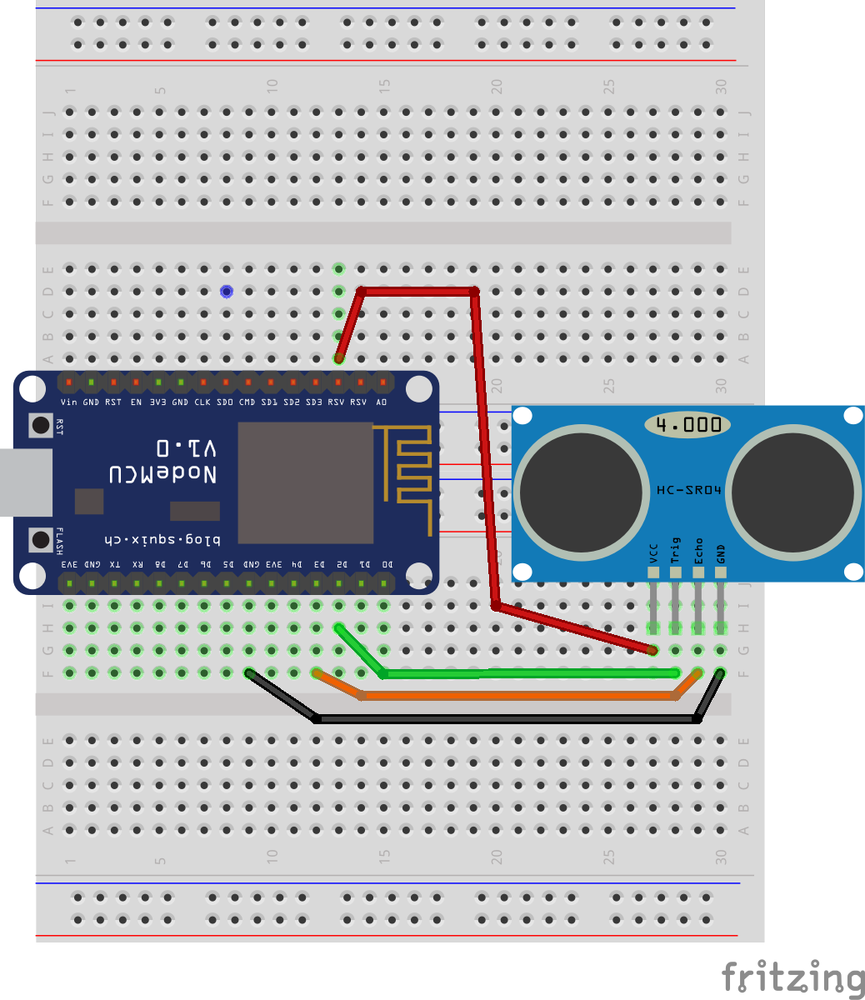

```python
from ultrasonic import Ultrasonic

ultra = Ultrasonic(4,0)

while True:
    print(ultra.distance_in_cm())

```

## ESP8266

Como hemos mencionado anteriormente, en la placa NodeMCU está presente un Chip ESP8266 que tiene unas cracterísticas especificas de las que carecen otros microcontroladores, como por ejemplo el poder unirnos a una red Wifi o crear un punto de acceso.

### Conectarse a una Wifi

El ESP8266 permite tanto conectarse a una wifi, como crear una wifi y tener un punto de acceso.

Para conectar a un punto de acceso podemos usar el módulo ```network```:

```python
import network

sta_if = network.WLAN(network.STA_IF)
sta_if.active(True)
sta_if.connect("SSID","PASSWORD")
sta_if.isconnected()
```

**Ejemplo conexion externa**

```python
import network
import socket


sta_if = network.WLAN(network.STA_IF)
sta_if.active(True)
sta_if.connect("SSID","PASSWORD")
sta_if.isconnected()

addr_info = socket.getaddrinfo("towel.blinkenlights.nl", 23)

addr = addr_info[0][-1]

s = socket.socket()
s.connect(addr)

while True:
     data = s.recv(500)
     print(str(data, 'utf8'), end='')
```

[Más info](https://docs.micropython.org/en/latest/esp8266/esp8266/tutorial/network_tcp.html#star-wars-asciimation)


### Crear un punto de acceso

Al igual que para conectarnos a un punto de acceso, podemos crear uno. Para ello usaremos el siguiente fragmento.

```python

import network

ap_if = network.WLAN(network.AP_IF)
ap_if.active(True)
```

### crear un servidor Web

Usando Un socket podemos crear un servidor web.

```python
import machine
pins = [machine.Pin(i, machine.Pin.IN) for i in (0, 2, 4, 5, 12, 13, 14, 15)]

html = """<!DOCTYPE html>
<html>
    <head> <title>ESP8266 Pins</title> </head>
    <body> <h1>ESP8266 Pins</h1>
        <table border="1"> <tr><th>Pin</th><th>Value</th></tr> %s </table>
    </body>
</html>
"""

import socket
addr = socket.getaddrinfo('0.0.0.0', 80)[0][-1]

s = socket.socket()
s.bind(addr)
s.listen(1)

print('listening on', addr)

while True:
    cl, addr = s.accept()
    print('client connected from', addr)
    cl_file = cl.makefile('rwb', 0)
    while True:
        line = cl_file.readline()
        if not line or line == b'\r\n':
            break
    rows = ['<tr><td>%s</td><td>%d</td></tr>' % (str(p), p.value()) for p in pins]
    response = html % '\n'.join(rows)
    cl.send(response)
    cl.close()
```

### Funciones especificas del ESP8266

El ESP8266 tiene funciones especificas que podemos utilizar.

módulo ```esp```:

```esp.sleep_type([sleep_type])```

Obtiene o establece el modo ahorro de energia.

* ```SLEEP_NONE``` - No establece el modo ahorro de energia.
* ```SLEEP_MODEM``` - desactiva la wifi.
* ```SLEEP_LIGHT``` - desactiva la wifi y el procesador.


```esp.deepsleep(time)```

Pone el circuito en modo ahorro de energia parando todos los circuitos incluido el procesador y temporizadores. Solo volvera al estado normal si se manda una señal por el GPIO16 (D0).


## WebREPL

Hasta ahora, hemos estado trabajando usando la consola serial. Sin embargo, podemos usar una consola web que nos permitirá trabajar con el microcontrolador via wifi.

Para esto, es necesario configurar el acceso a la consola WebREPL, activandolo y además configurando una contraseña.

Para configurar el WebREPL, nos conectaremos a la placa por consola Serial, e introduciremos la siguiente instrucción:

```python
import webrepl_setup
```

Tras esto, se nos preguntara si queremos activar el WebREPL, pulsando E (enable) para activarlo.

Si por el contrario una vez conectado queremos iniciarla tendremos que introducir el siguiente codigo.

```python
import webrepl

webrepl.start()
```

Seguidamente nos preguntará por la contraseña que pondremos para entrar en la consola WebREPL. La cual introduciremos dos veces.

Una vez finalizado, la placa se reiniciara y podremos entrar en la consola web.

Si no hemos modificado nada por defecto la NodeMCU estará en modo AP(Acces Point) por lo que podremos conectarnos a una wifi llamada MicroPython-XXX. Esta wifi nos permitira conectarnos a la consola.

Pero antes de conectarnos, debemos entrar en la siguiente dirección:

http://micropython.org/webrepl/

Una vez conectados, ya podremos conectar a la wifi de MicroPython (La contraseña por defecto es "micropythoN").

Tras esto ya podemos conectar usando la webREPL introducimos la dirección IP y puerto para conectar y pulsamos el boton conectar. Nos preguntara la contraseña que pusimos al configurar el WebREPL y una vez introducida veremos la consola Python.


## Proyecto final

Una vez hemos visto todo lo necesario para crear el proyecto final de este curso. En este caso, vamos a crear un pequeño instrumento musica que en función de la distancia medida con el sensor de ultrasonidos, usaremos el buzzer para crear distintas notas.

Además podemos crear iluminacion con los leds conectados e iluminando estos en función de la distancia medida con el sensor.

**Recursos**

* [Buzzer con micropython](https://pypi.python.org/pypi/micropython-buzzer/1.0.0)
* [Ultrasonic](ultrasonic.py)

**NOTA**: para instalar este paquete, tenemos que ejecutar upip.

```bash
$ micropython -m upip install micropython-pystone
```

* [upip instalación](https://pypi.python.org/pypi/micropython-upip/)

También puede ejecutarse dentro del propio microcontrolador.

```
import upip

upip.install('https://github.com/fruch/micropython-buzzer')
```

## Ejercicios opcionales

* Micropython trae un modulo especifico para el DHT11 que permite medir temperatura y humedad del aire. Se pide poder mostrar por consola el valor de la temperatura y humedad usando este [módulo](http://docs.micropython.org/en/latest/esp8266/esp8266/quickref.html?highlight=dht#dht-driver).

* Micropython tiene un modulo especifico llamado neopixel, este modulo permite controlar los leds de una tira. Se pide cambiar los colores de una tira de leds con el tiempo. para ello usar el siguiente [módulo](http://docs.micropython.org/en/latest/esp8266/esp8266/quickref.html?highlight=dht#neopixel-driverhttp://docs.micropython.org/en/latest/esp8266/esp8266/quickref.html?highlight=dht#neopixel-driver).


## Pinout del NodeMCU


## Pinout del Wemos D1 Mini


## Referencias

* [MicroPython Documentacion Oficial](https://docs.micropython.org/en/latest/esp8266/index.html)
* [AdaFruit MicroPython Tutorial](https://learn.adafruit.com/building-and-running-micropython-on-the-esp8266/overview)
* https://github.com/wendlers/mpfshell
* [Anaconda](https://anaconda.org/anaconda/python)
* [upip](https://github.com/micropython/micropython-lib)
